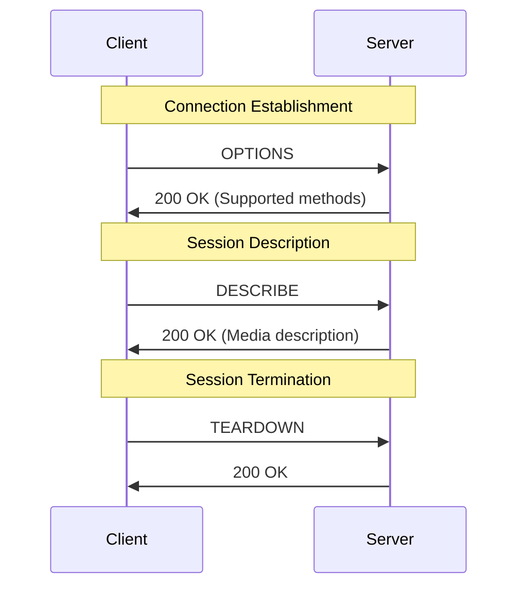
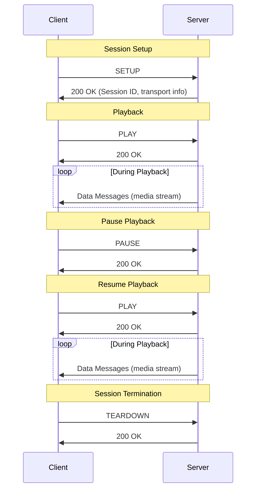
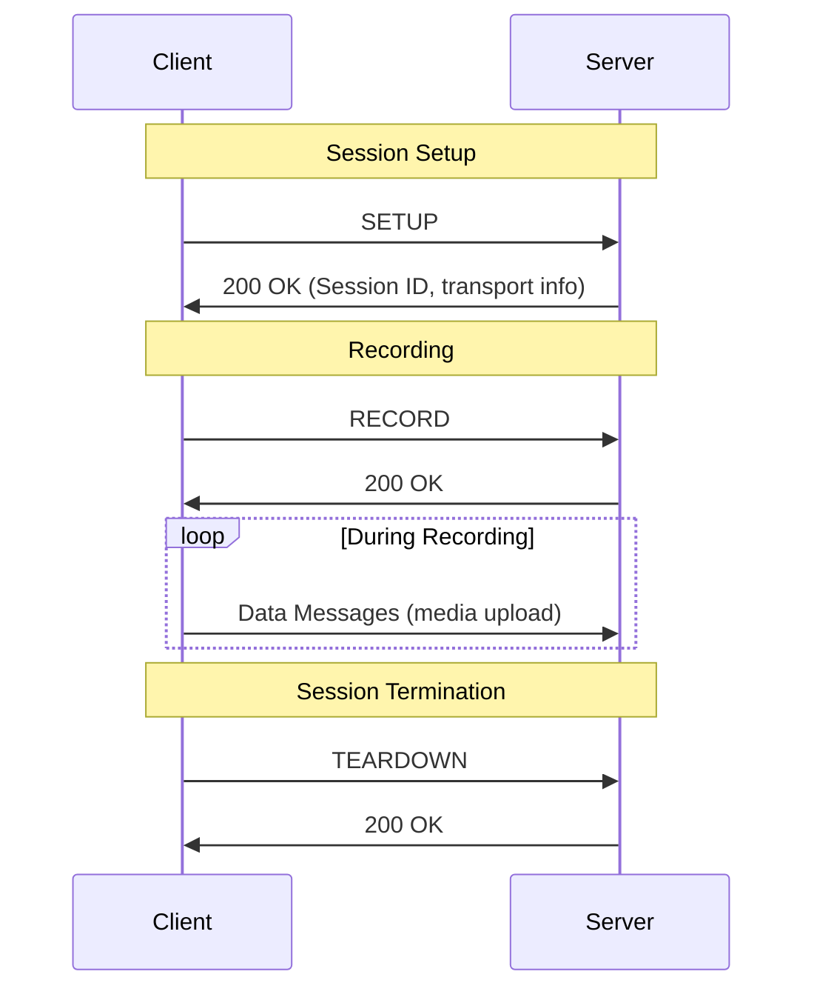

# Simultaneous Audio Streaming Service

## Description

For this project, we will be using the Real-Time Streaming Protocol (RTSP). We will not use the entire protocol; just a portion, to make it viable to code within the project's time frame.

[RFC2326 Link](https://datatracker.ietf.org/doc/html/rfc2326#section-10.1)

## Installation

- To setup the project run the following:
```bash
ant dist
```

- Run the server first is as follows:
```bash
java -jar dist/server.jar
```

- Run the client next as follows:
```bash
java -jar dist/client.jar
```

## Protocol Diagram

### Now what Message Types and Description of Server


### Playing Music


### Record Music onto Server



## Methods Included

### Options
 - This method allows a client to see the different method types that the server they are wishing to connect to has.
 - Example of how the messages are structured;
   ```
   C -> S
   Options * RTSP/1.0
   CSeq: x

   ------------------------------

   S -> C
   RTSP/1.0 200 OK
   CSeq: x
   Public: <list_of_methods>
   ```

### Describe
 - This allows a client to show all the contents that are on a given server.
 - Example of how the messages are structured:
   ```
   C -> S
   DESCRIBE rtsp://server/media RTSP/1.0
   CSeq: x
   Accept: application/sdp

   ------------------------------
   S -> C
   RSTP/1.0 200 OK
   CSeq: x
   Content-Type: application/sdp
   Content-Length: nnn
   <SDP_body>
   ```

### Setup
 - This allows a client to set up a transport mechanism to be used for streaming media.
 - Example of how the messages are structured:
   ```
   C -> S
   SETUP rtsp://server/media RTSP/1.0
   CSeq: x
   Transport: <transport_parameters>

   ------------------------------
   S -> C
   RTSP/1.0 200 OK
   CSeq: x
   Session: <session_id>
   Transport: <transport-parameters>
   ```

### Play
 - This allows a client to play media from the given server.
 - Example of how the messages are structured:
   ```
   C -> S
   PLAY rtsp://server/media RTSP/1.0
   CSeq: x
   Session: <session_id>
   Range: <start>-<end> (optional)

   ------------------------------
   S -> C
   RTSP/1.0 200 OK
   CSeq: x
   Session: <session_id>
   RTP-Info: <sync_info> (optional)

### Pause
 - This allows a client to pause media from being played from the given server.
 - Example of how the messages are structured:
   ```
   C -> S
   PAUSE rtsp://server/media RTSP/1.0
   CSeq: x
   Session: <session_id>

   ------------------------------
   S -> C
   RTSP/1.0 200 OK
   CSeq: x
   Session: <session_id>
   ```

### Record
 - This allows a client actually to upload the media to the server.
 - Example of how the messages are structured:
   ```
   C -> S
   RECORD rtsp://server/media RTSP/1.0
   CSeq: x
   Session: <session_id>
   Range: clock=20250101T120000Z
   
   ------------------------------
   S -> C
   RTSP/1.0 200 OK
   CSeq: x
   Session: <session_id>
   ```

### Teardown
 - This allows a client to tear down a session with the given server.
 - Example of how the messages are structured:
   ```
   C -> S
   TEARDOWN rtsp://server/media RTSP/1.0
   CSeq: x
   Session: <session_id>

   ------------------------------
   S -> C
   RTSP/1.0 200 OK
   CSeq: x
   ```

# Contributers

Sean Ouellette
Erin McNulty

   
   
